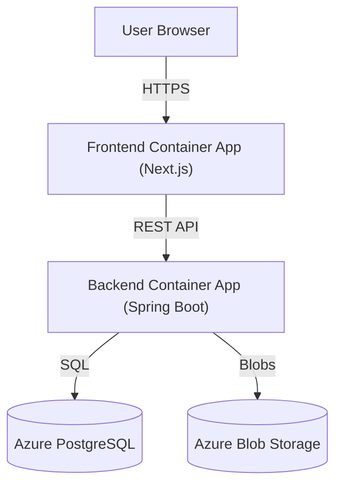

# Twitter Clone (Azure Deployment)

A full-stack, pixel-perfect Twitter/X clone built with **Next.js 15** and **Spring Boot 3**, designed for cloud-native deployment on **Azure Container Apps**.

## 🚀 Tech Stack

### Frontend
-   **Framework**: Next.js 15 (App Router)
-   **Language**: TypeScript
-   **Styling**: Tailwind CSS, Shadcn/UI
-   **State Management**: Zustand, TanStack Query
-   **Authentication**: Custom JWT Auth + Google OAuth
-   **Icons**: Lucide React
-   **Build**: Docker (Multi-stage)

### Backend
-   **Framework**: Spring Boot 3.4
-   **Language**: Java 21
-   **Database**: PostgreSQL
-   **Storage**: Azure Blob Storage (for media)
-   **Security**: Spring Security 6, JWT, OAuth2 (Google)
-   **Migration**: Flyway
-   **Build**: Maven, Docker

### DevOps & Cloud
-   **Containerization**: Docker
-   **Registry**: Azure Container Registry (ACR)
-   **Orchestration**: Azure Container Apps (ACA)
-   **CI/CD**: GitHub Actions
-   **Database**: Azure Database for PostgreSQL (Flexible Server)

## 🏗️ Architecture

The application follows a microservices-ready architecture deployed on Azure:



## ✨ Features

-   **Authentication**: Sign up/Sign in with Email or Google.
-   **Feed**: For You (Algorithm) and Following feeds.
-   **Tweets**: Create rich text tweets, upload images, reply, quote, and repost.
-   **Interactions**: Like, save/bookmark, and share tweets.
-   **Search**: Full-text search for users and hashtags.
-   **Notifications**: Real-time notifications for interactions.
-   **Profile**: Customizable user profiles with banners and avatars.
-   **Premium**: Subscription mock-up flow with "Blue Check" verification.
-   **Responsive**: Fully responsive mobile-first design.

## 🛠️ Getting Started (Local)

### Prerequisites
-   Node.js 20+
-   Java 21 (JDK)
-   Docker & Docker Compose

### 1. Database Setup
Run PostgreSQL locally using Docker Compose:
```bash
docker-compose up -d
```

### 2. Backend Setup
Navigate to `twitter-backend`:
1.  Configure `src/main/resources/application.yml` (or use env vars) to point to your local DB.
2.  Run the application:
    ```bash
    ./mvnw spring-boot:run
    ```

### 3. Frontend Setup
Navigate to `twitter-frontend`:
1.  Install dependencies: `npm install`
2.  Create `.env.local` based on `.example.env`.
3.  Run the development server:
    ```bash
    npm run dev
    ```
4.  Open [http://localhost:3000](http://localhost:3000).

## ☁️ Deployment (Azure Container Apps)

This project is configured for automated deployment via GitHub Actions.

### 1. Infrastructure Setup
You need the following Azure resources:
-   **Resource Group**
-   **Azure Container Registry (ACR)**
-   **Container Apps Environment**
-   **PostgreSQL Flexible Server**

### 2. Environment Variables
Configure these secrets in your GitHub Repository settings for the workflows to work:

| Secret Name | Description |
|---|---|
| `AZURE_CREDENTIALS` | JSON credential from `az ad sp create-for-rbac` |
| `REGISTRY_USERNAME` | ACR Admin Username |
| `REGISTRY_PASSWORD` | ACR Admin Password |
| `REGISTRY_LOGIN_SERVER` | e.g., `myacr.azurecr.io` |
| `AZURE_RESOURCE_GROUP` | Resource Group Name |
| `NEXT_PUBLIC_API_URL` | **(Build Arg)** URL of your deployed Backend Container App |
| `NEXT_PUBLIC_GOOGLE_CLIENT_ID` | **(Build Arg)** Google OAuth Client ID |

### 3. Container Configuration
Ensure your Container Apps have the following environment variables set in the Azure Portal:

**Backend Container App:**
-   `DB_URL`: JDBC URL for Azure Postgres
-   `DB_USER`: Database Username
-   `DB_PASSWORD`: Database Password
-   `APP_FRONTEND_URL`: URL of your deployed Frontend Container App (for CORS)
-   `AZURE_STORAGE_ACCOUNT_NAME`: Blob Storage Account Name
-   `AZURE_STORAGE_ACCOUNT_ACCESS_KEY`: Blob Storage Key
-   `GOOGLE_OAUTH_CLIENT_ID`: Google Client ID

**Frontend Container App:**
-   *Note: Frontend env vars are baked in at build time via GitHub Actions secrets.*

### 4. CI/CD Pipelines
-   **Backend Pipeline** (`deploy-backend.yml`): Triggers on changes to `twitter-backend/**`. Builds Java 21 image, pushes to ACR, deploys to ACA.
-   **Frontend Pipeline** (`deploy-frontend.yml`): Triggers on changes to `twitter-frontend/**`. Builds Node 20 image (injecting `NEXT_PUBLIC_API_URL`), pushes to ACR, deploys to ACA.

## 📄 License
MIT
