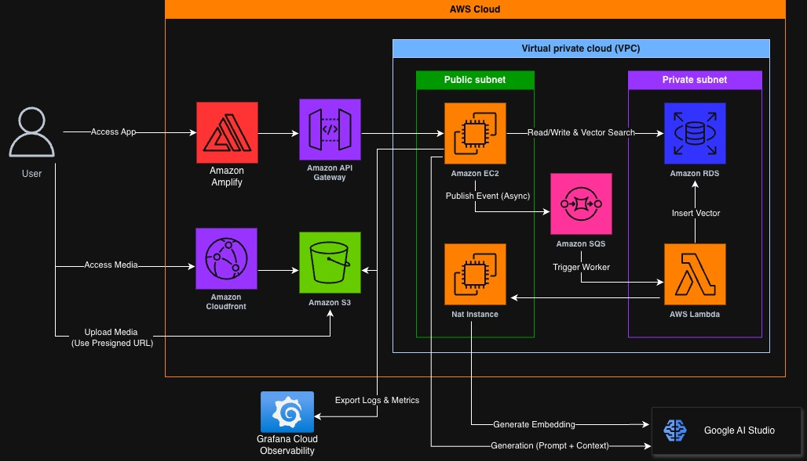
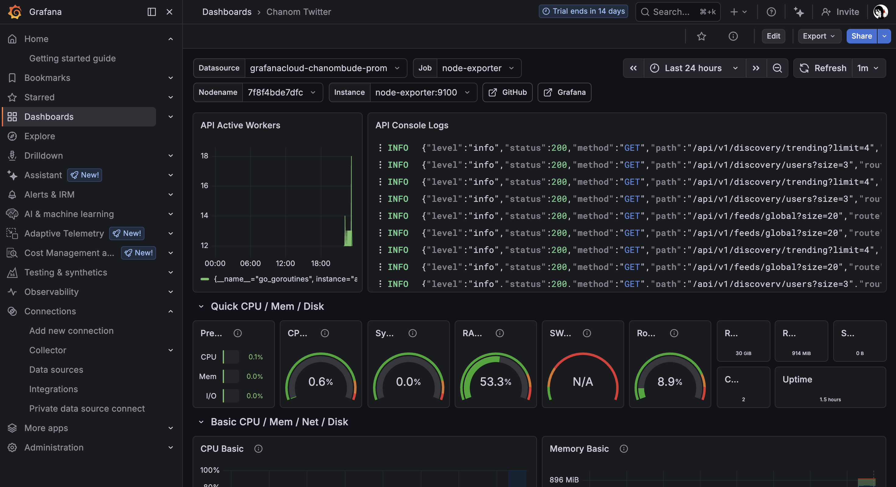

# Twitter Clone

Full-stack Twitter/X clone with a Next.js frontend, Go backend, and production-ready AWS infrastructure managed by Terraform—featuring a complete observability stack with Grafana Cloud, Prometheus, and Loki.

## Features

- **Authentication** — Google OAuth with JWT access & refresh tokens
- **Tweets** — Create, delete, like, retweet, and threaded replies
- **Feeds** — "For You" global feed with **time-decay gravity algorithm** (weighing likes, retweets, and replies), following-only feed, and per-user profile feed
- **Follow / Unfollow** — Follow users with follower & following lists
- **Media Uploads** — S3 presigned-URL uploads served via CloudFront CDN
- **Real-time Notifications** — Server-Sent Events (SSE) streaming with unread count
- **Direct Messages** — Real-time conversations over WebSocket
- **Search** — Search users, tweets, and hashtags
- **Trending & Discovery** — Trending hashtags and suggested users
- **Observability** — Real-time metrics (Prometheus) and log aggregation (Loki) via Grafana Cloud

## Tech Stack

| Layer | Technologies |
|---|---|
| Frontend | Next.js (App Router), TypeScript, Tailwind CSS, TanStack Query, Zustand |
| Backend | Go, Gin, PostgreSQL + sqlc, Redis |
| Infrastructure | AWS (Amplify, API Gateway, EC2, RDS, S3, CloudFront), Terraform, GitHub Actions |
| Observability | **Grafana Cloud** (Loki, Prometheus), **Grafana Alloy**, **Node Exporter** |

## Architecture



## Observability

We use **Grafana Cloud** for a "Single Pane of Glass" monitoring experience. The EC2 instance runs **Grafana Alloy** alongside **Node Exporter** to provide a unified view of hardware health, Go application performance, and real-time logs.



## Prerequisites

| Tool | Purpose |
|---|---|
| [Go](https://go.dev/dl/) | Backend API development |
| [Node.js](https://nodejs.org/) (v18+) | Frontend development |
| [Docker](https://www.docker.com/) | Local Postgres + Redis, and production deployment |
| [AWS CLI v2](https://docs.aws.amazon.com/cli/latest/userguide/getting-started-install.html) | AWS resource management & SSH tunneling |
| [Terraform](https://developer.hashicorp.com/terraform/install) (v1.5+) | Infrastructure provisioning |
| [Make](https://www.gnu.org/software/make/) | Running Go API tasks (migrations, etc.) |
| [Google Cloud Console](https://console.cloud.google.com/) | Google OAuth 2.0 Client ID for authentication |

**Install via Homebrew (macOS):**

```bash
brew install go node docker awscli hashicorp/tap/terraform make
```

## Third-Party Setup

### 1. Google OAuth 2.0 Setup

This project uses Google OAuth for authentication. You need to create a Client ID to allow users to sign in.

1.  Go to the [Google Cloud Console](https://console.cloud.google.com/).
2.  **Create a Project**: Click on the project dropdown and select "New Project".
3.  **OAuth Consent Screen**:
    - Go to "APIs & Services" > "OAuth consent screen".
    - Select **External** and click "Create".
    - Fill in the required App Information (App name, support email, developer email).
    - Save and continue until the end.
4.  **Create Credentials**:
    - Go to "APIs & Services" > "Credentials".
    - Click **+ Create Credentials** > **OAuth client ID**.
    - Select **Web application** as the Application type.
    - **Authorized JavaScript origins**:
      - `http://localhost:3000` (Local)
      - `https://main.<app-id>.amplifyapp.com` (Production - update after deployment)
    - **Authorized redirect URIs**:
      - `http://localhost:3000/api/auth/callback/google`
5.  **Copy Client ID**: Save the **Client ID**. You will need this for your `.env` files and Terraform variables.

### 2. Grafana Cloud Setup (Monitoring)

This project supports centralized logging and metrics via [Grafana Cloud](https://grafana.com/products/cloud/) (Free Tier).

1.  Sign up for a free account at [Grafana Cloud](https://grafana.com/).
2.  In the Cloud Portal, find the **Prometheus** and **Loki** tiles.
3.  Click **Send Logs** for Loki and **Send Metrics** for Prometheus to find your:
    - **URL**
    - **User ID**
4.  Create an **Access Policy** (or API Token) with `metrics:write` and `logs:write` scopes.
5.  Add these values to your `infra/terraform/terraform.tfvars` to enable automatic monitoring.

## Local Development

### 1. Start infra (Postgres + Redis)

```bash
docker-compose up -d
```

### 2. Run Go API

```bash
cd twitter-go-api
# Ensure you have created app.env from app.env.example
make migrateup
make run
```

### 3. Run Next.js Web

```bash
cd twitter-next-web
npm install
npm run dev
```

Web: `http://localhost:3000`
API: `http://localhost:8080`

## Validation Commands

Before pushing or deploying, ensure everything is correct:

**Go API:**
```bash
cd twitter-go-api
go test ./...
```

**Next.js Web:**
```bash
cd twitter-next-web
npx tsc --noEmit
npm run lint
```

## AWS Infrastructure

| Service | Purpose |
|---|---|
| **Amplify** | Hosts & auto-deploys the Next.js frontend (SSR) |
| **API Gateway** | HTTP API proxy to the backend EC2 instance |
| **EC2** | Runs the Go API in Docker via `docker compose` |
| **RDS** | Managed PostgreSQL database (private subnet) |
| **S3** | Media storage with presigned-URL uploads |
| **CloudFront** | CDN for serving S3 media over HTTPS |
| **SSM Parameter Store** | Securely manages, stores, and injects runtime configuration into the Go API |
| **Grafana Alloy** | Efficient agent on EC2 for scraping Go metrics and forwarding Docker logs to Loki |
| **Node Exporter** | Sidecar container providing system-level metrics (CPU, Memory, Disk) for the EC2 host |
| **Terraform** | Infrastructure as Code for all resources (using `.tftpl` templates for configuration) |
| **GitHub Actions** | CI/CD pipeline pulling from GHCR and deploying via SSM Run Command |

## AWS Setup

> You need an [AWS account](https://aws.amazon.com/free/) to deploy this project.

### 1. Create an IAM user for Terraform

1. Go to the [IAM Console](https://console.aws.amazon.com/iam/) → Users → **Create user**
2. Attach the **AdministratorAccess** policy (for a learning project; use least-privilege in production)
3. Create an **Access Key** (select "CLI" use case) and save the Access Key ID and Secret

### 2. Configure AWS CLI

```bash
aws configure
```

Enter your Access Key ID, Secret, region (`ap-southeast-1`), and output format (`json`).

### 3. Provision infrastructure

```bash
cd infra/terraform
cp terraform.tfvars.example terraform.tfvars  # Fill in your values
terraform init
terraform plan     # Review what will be created
terraform apply    # Create all resources (~5 min)
```

> **Tip:** Use `terraform output` to view your infrastructure details at any time—it is a safe, read-only command.

To tear down all resources and **stop all AWS charges**:

```bash
terraform destroy
```


## Deployment

### Frontend — AWS Amplify

The frontend is deployed automatically via **AWS Amplify**, configured through Terraform ([`amplify.tf`](infra/terraform/amplify.tf)).

**How it works:**

1. Amplify connects to the GitHub repository using a Personal Access Token
2. On every push to `main`, Amplify auto-builds the Next.js app:
   - Runs `npm ci` and `npm run build` inside `twitter-next-web/`
   - Deploys as a Server-Side Rendered (SSR) application (`WEB_COMPUTE` platform)
3. Environment variables (e.g. `NEXT_PUBLIC_API_URL`) are injected by Terraform from the API Gateway stage URL

**Amplify default URL pattern:** `https://<branch>.<app-id>.amplifyapp.com`

### Backend — GitHub Actions → EC2

The Go API is deployed via the [`deploy-go-api.yml`](.github/workflows/deploy-go-api.yml) GitHub Actions workflow.

**Trigger:** Push to `main` when `twitter-go-api/**` changes, or manual dispatch.

**Pipeline:**

1. **Test** — Sets up Go and runs `go test ./...`
2. **Build & Push** — Builds a Docker image and pushes it to GitHub Container Registry (GHCR)
3. **Deploy** — Sends commands to EC2 via **AWS SSM** (no SSH key needed), pulls the latest image, and restarts the container via `docker compose`

**Required GitHub Secrets:**

| Secret | Description |
|---|---|
| `AWS_ACCESS_KEY_ID` | IAM access key for SSM commands |
| `AWS_SECRET_ACCESS_KEY` | IAM secret key |
| `AWS_REGION` | AWS region (e.g. `ap-southeast-1`) |
| `EC2_INSTANCE_ID` | EC2 instance ID (e.g. `i-0e83a1b99...`) |
| `GHCR_PAT` | GitHub PAT with `read:packages` scope for pulling from GHCR |

## AWS Access

### SSH into EC2

Connect to the EC2 instance using **EC2 Instance Connect Endpoint** (no `.pem` key needed):

```bash
aws ec2-instance-connect ssh --instance-id <INSTANCE_ID> --connection-type eice
```

**Alternative (Web Portal):**
1. Go to **AWS Console** → **EC2** → **Instances**
2. Select your instance and click **Connect**
3. Select the **EC2 Instance Connect** tab
4. **Connection Type**: Select **"Connect using a Private IP"**
5. **EC2 Instance Connect Endpoint**: Select your endpoint from the dropdown (e.g., `eice-xxxx...`)
6. Click **Connect** to open a terminal in your browser.

### Monitoring Startup Logs (Initialization)

When Terraform creates an EC2 instance, it is only "hardware-ready." It takes an additional 2-3 minutes for the software (Docker, API, Monitoring) to finish installing and starting up.

To watch the progress of your startup scripts in real-time:

1. SSH into the instance (as shown above).
2. Run this command to follow the initialization logs:

```bash
tail -f /var/log/cloud-init-output.log
```

**Common "Early-login" Errors:**
* `docker: command not found` — The dnf installer is still running.
* `Cannot connect to Docker daemon` — Docker service is still booting.
* `No data` in Grafana — The monitoring agent hasn't reached the "Loki" setup step yet.

Once you see the "✅ Setup Complete!" message in the log, your server is 100% ready.

### Connect to RDS (via SSH tunnel)

RDS is in a private subnet and cannot be accessed directly. Use the EC2 instance as a bastion host to create an SSH tunnel:

```bash
aws ec2-instance-connect ssh \
    --instance-id <INSTANCE_ID> \
    --connection-type eice \
    --local-forwarding 5433:<RDS_ENDPOINT>:5432
```

This forwards your local port `5433` to RDS port `5432` through the EC2 instance. Port `5433` is used to avoid conflicts with any local PostgreSQL running on `5432`.

**Keep the terminal window open**, then connect with your database tool (DBeaver, TablePlus, etc.):

| Setting | Value |
|---|---|
| Host | `127.0.0.1` |
| Port | `5433` |
| Database | `twitter_db` |
| Username | _(from `terraform.tfvars`)_ |
| Password | _(from `terraform.tfvars`)_ |

> **Tip:** Add `-- -N` at the end to open the tunnel without dropping into the EC2 shell:
> ```bash
> aws ec2-instance-connect ssh \
>     --instance-id <INSTANCE_ID> \
>     --connection-type eice \
>     --local-forwarding 5433:<RDS_ENDPOINT>:5432 \
>     -- -N
> ```

## Project Structure

```
├── twitter-next-web/    # Next.js frontend
├── twitter-go-api/      # Go backend (primary)
├── twitter-java-api/    # Java backend (legacy/alternative)
├── infra/
│   ├── terraform/       # AWS infrastructure (Terraform)
│   └── ec2/             # Docker Compose templates (.tftpl) & Alloy configuration
├── docs/
│   └── assets/          # Architecture diagrams & Monitoring screenshots
└── .github/workflows/   # CI/CD pipelines (GitHub Actions)
```
